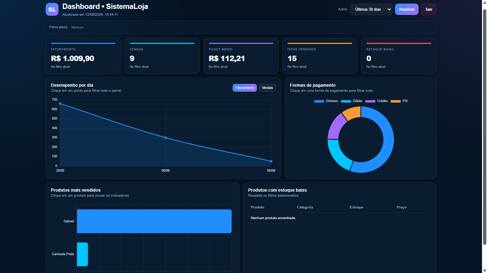
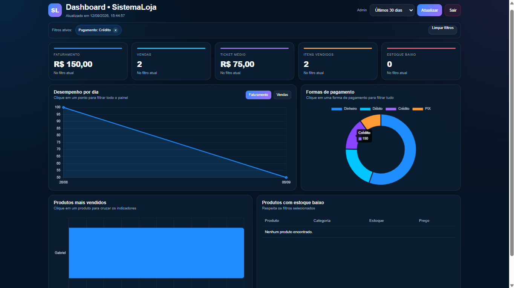
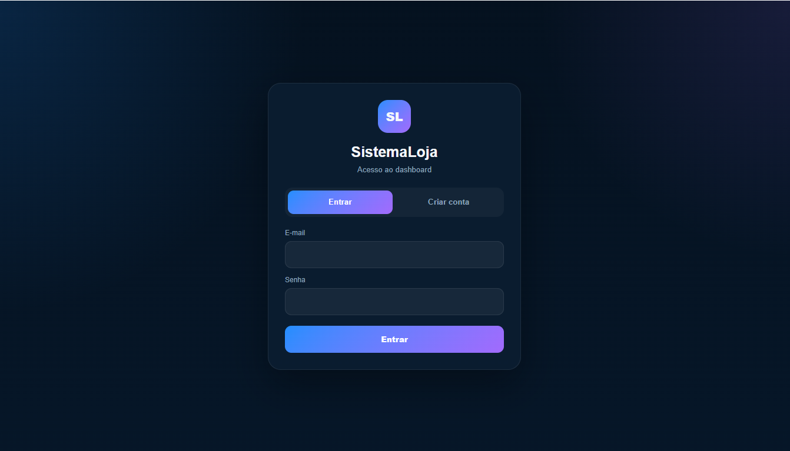

# 📊 SistemaLoja Dashboard

Dashboard web interativo desenvolvido para visualização e análise de dados de um sistema de vendas.

O projeto integra **SQL Server, Python, Flask, Google Apps Script, HTML, CSS, JavaScript e Chart.js**, permitindo acompanhar indicadores de vendas e estoque através de uma interface web.

---

## 🖥️ Dashboard



---

## 🎯 Objetivo

O objetivo do projeto foi transformar os dados registrados no sistema de vendas em informações visuais e úteis para acompanhamento do negócio.

O dashboard consulta os dados armazenados no **SQL Server** e apresenta indicadores de forma simples, interativa e acessível pelo navegador.

---

## 📈 Indicadores

O dashboard apresenta:

- Faturamento
- Quantidade de vendas
- Ticket médio
- Itens vendidos
- Produtos com estoque baixo
- Faturamento por dia
- Formas de pagamento
- Produtos mais vendidos
- Estoque atual

Também é possível selecionar diferentes períodos de análise.

---

## 🔎 Filtros interativos

Os gráficos funcionam como filtros cruzados.

Por exemplo, ao selecionar uma forma de pagamento como **Cartão**, os demais indicadores e gráficos são recalculados considerando apenas essas vendas.

O mesmo comportamento pode ser utilizado para:

- Forma de pagamento
- Produto
- Data
- Período



---

## 🔐 Controle de acesso

O dashboard possui uma tela própria de autenticação.

Novos usuários podem solicitar acesso e o administrador pode aprovar ou rejeitar o cadastro antes que os dados do dashboard sejam liberados.



---

## 🏗️ Arquitetura

```text
Sistema PDV
    │
    ▼
SQL Server
SistemaLoja
    │
    ▼
Python / Flask API
    │
    ▼
Cloudflare Tunnel
HTTPS
    │
    ▼
Google Apps Script
    │
    ▼
Dashboard HTML / JavaScript
    │
    ▼
Chart.js
