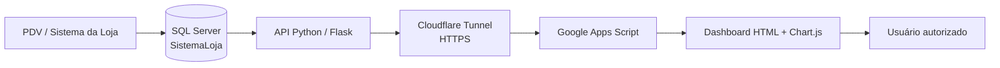

# Arquitetura

## Fluxo de dados

1. O PDV registra vendas, produtos e movimentações no SQL Server.
2. A API Python executa consultas agregadas para o dashboard.
3. O SQL Server não é exposto diretamente à internet.
4. O Google Apps Script consulta a API por HTTPS.
5. O front-end renderiza KPIs e gráficos interativos com Chart.js.
6. Os gráficos permitem filtros cruzados por período, forma de pagamento, produto e data.
